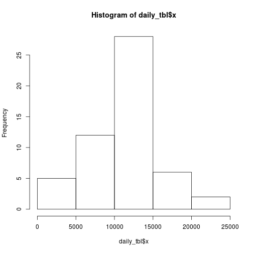
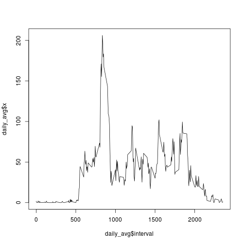
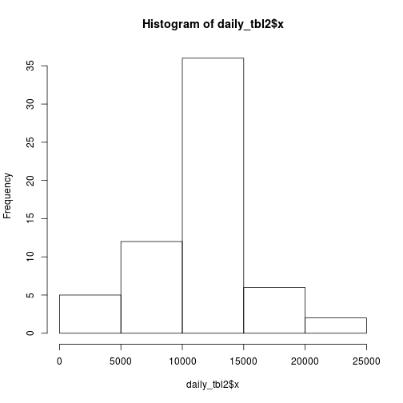
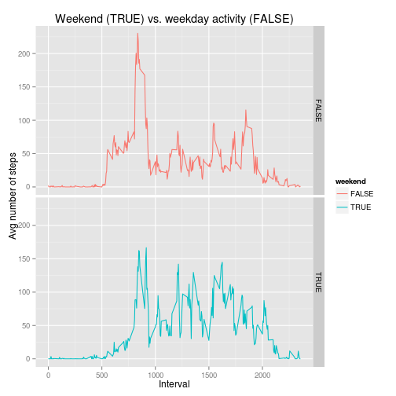

Course project 1 ... learning about markdown documents


```r
  file = "activity.csv"       
	act.col.class <- c("numeric", "character", "numeric")
	act <- read.csv(file,header=TRUE,colClasses=act.col.class,stringsAsFactors=FALSE)

	act$date <- as.Date(act$date)
```

__What is mean total number of steps taken per day ?__  

For this part of the assignment, you can ignore the missing values in the dataset.  
    1. Calculate the total number of steps taken per day  
    2. Make a histogram of the total number of steps taken each day  
    3. Calculate and report the mean and median of the total number of steps taken per day  
    

```r
  daily_tbl <- aggregate(act$steps,list(date=act$date),sum)

  hist(daily_tbl$x)
```

 

```r
  daily_median <- median(daily_tbl$x, na.rm = TRUE)
  daily_mean <- mean(daily_tbl$x, na.rm = TRUE)
```

  __Median steps / day = 1.0765 &times; 10<sup>4</sup> __  
  __Mean steps / day   = 1.0766189 &times; 10<sup>4</sup> __   

-=-=-=-=-=-=-=-=-=-=-=-=-=-=-=-=-=-=-=-=-=-=-=-=-=-=-=-=-=-=-=-=-=-=-=-=-=-=-=-  
__What is the average daily activity pattern ?__  
-=-=-=-=-=-=-=-=-=-=-=-=-=-=-=-=-=-=-=-=-=-=-=-=-=-=-=-=-=-=-=-=-=-=-=-=-=-=-=-  
1. Make a timme series plot (i.e. type = "l") of the 5-minute interval (x-axis) and the average number of steps taken, averaged across all days (y-axis)
2. Which 5-minute interval, on average across all the days in the dataset, contains the maximum number of steps?


```r
  act2 <- subset(act, !is.na(steps))
  daily_avg <- aggregate(act2$steps, list (interval = act2$interval), mean)

  plot(daily_avg$interval, daily_avg$x, type = 'l')
```

 

```r
  max_indx <- order(daily_avg$x, decreasing = TRUE)[1]
  max_interval <- daily_avg$interval[max_indx]
```

__Interval with maximum average number of steps = 835__  


-=-=-=-=-=-=-=-=-=-=-=-=-=-=-=-=-=-=-=-=-=-=-=-=-=-=-=-=-=-=-=-=-=-=-=-=-=-=-=-  
__Imputing missing values__  
-=-=-=-=-=-=-=-=-=-=-=-=-=-=-=-=-=-=-=-=-=-=-=-=-=-=-=-=-=-=-=-=-=-=-=-=-=-=-=-  

Note that there are a number of days/intervals where there are missing values (coded as NA). The presence of missing days may introduce bias into some calculations or summaries of the data.

1. Calculate and report the total number of missing values in the dataset (i.e. the total number of rows with NA)  

```r
missing_values <- length(act[!complete.cases(act),][[1]])
```
__- rows with missing values = 2304  __ 

2. Devise a strategy for filling in all of the missing values in the dataset. The strategy does not need to be sophisticated. For example, you could use the mean/median for that day, or the mean for that 5-minute interval, etc.  
3. Create a new dataset that is equal to the original dataset but with the missing data filled in.  


```r
require(plyr)
require(Hmisc)

  act_nonas <- ddply(act, "interval", mutate, imputed.steps = impute(steps, mean))

# ... look at some rows to verfy what we have created

  head (act_nonas, 10)
```

```
##    steps       date interval imputed.steps
## 1     NA 2012-10-01        0      1.716981
## 2      0 2012-10-02        0      0.000000
## 3      0 2012-10-03        0      0.000000
## 4     47 2012-10-04        0     47.000000
## 5      0 2012-10-05        0      0.000000
## 6      0 2012-10-06        0      0.000000
## 7      0 2012-10-07        0      0.000000
## 8     NA 2012-10-08        0      1.716981
## 9      0 2012-10-09        0      0.000000
## 10    34 2012-10-10        0     34.000000
```

4. Make a histogram of the total number of steps taken each day and Calculate and report the mean and median total number of steps taken per day.  


```r
  daily_tbl2 <- aggregate(act_nonas$imputed.steps, list (date = act_nonas$date), sum)

  hist(daily_tbl2$x)
```

 

```r
  daily_median2 <- median(daily_tbl2$x, na.rm = TRUE)
  daily_mean2 <- mean(daily_tbl2$x, na.rm = TRUE)
```

  __Median steps / day (with imputation) = 1.0766189 &times; 10<sup>4</sup> __  
  __Mean steps / day (with imputation)  = 1.0766189 &times; 10<sup>4</sup> __   

- Do these values differ from the estimates from the first part of the assignment?  
__--> Median and Mean are now equal__  

- What is the impact of imputing missing data on the estimates of the total daily number of steps?  
__--> Median and Mean are now equal__  

-=-=-=-=-=-=-=-=-=-=-=-=-=-=-=-=-=-=-=-=-=-=-=-=-=-=-=-=-=-=-=-=-=-=-=-=-=-=-=-  
__Are there differences in activity patterns between weekdays and weekends ?__  
-=-=-=-=-=-=-=-=-=-=-=-=-=-=-=-=-=-=-=-=-=-=-=-=-=-=-=-=-=-=-=-=-=-=-=-=-=-=-=-  


```r
require(timeDate)
require(ggplot2)

  act_nonas$weekend <- as.factor(isWeekend(act_nonas$date, wday = 1:5))
  daily_avg_rdx <- aggregate(act_nonas$imputed.steps,
                             list (interval = act_nonas$interval,
                                   weekend = act_nonas$weekend),
                             mean)

  qplot(interval, x, data = daily_avg_rdx, geom = "line", facets = weekend~.,
        main = "Weekend (TRUE) vs. weekday activity (FALSE)",
        xlab = "Interval",
        ylab = "Avg number of steps",
        color = weekend)
```

 

